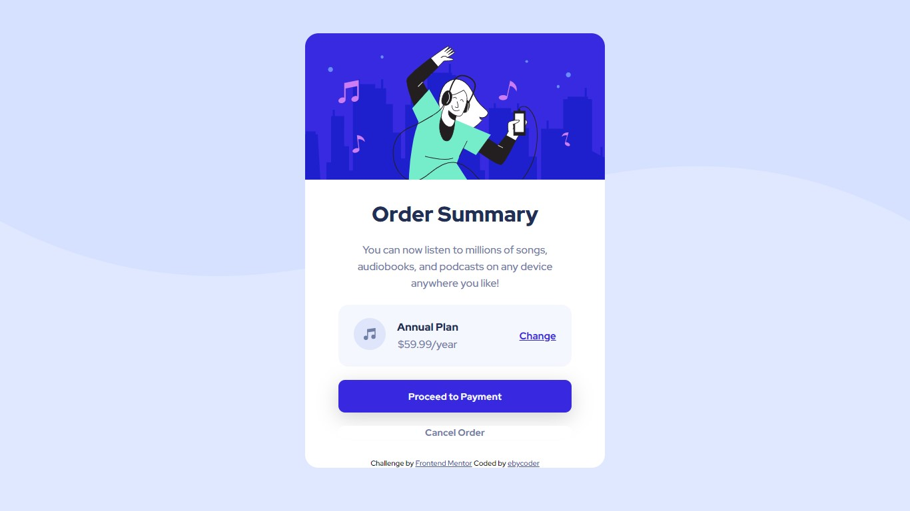

# Frontend Mentor - Order summary card solution

This is a solution to the [Order summary card challenge on Frontend Mentor](https://www.frontendmentor.io/challenges/order-summary-component-QlPmajDUj). Frontend Mentor challenges help you improve your coding skills by building realistic projects. 

## Table of contents

- [Overview](#overview)
  - [The challenge](#the-challenge)
  - [Screenshot](#screenshot)
  - [Links](#links)
- [My process](#my-process)
  - [Built with](#built-with)
  - [What I learned](#what-i-learned)
  - [Useful resources](#useful-resources)
- [Author](#author)


## Overview

### The challenge

Users should be able to:
- See responsive states for different screen widths
- See hover states for interactive elements

### Screenshot




### Links

- Live Site URL: [Live-Site URL here](https://your-live-site-url.com)

## My process

### Built with

- Semantic HTML5 markup
- CSS custom properties
- Flexbox
- CSS Grid

### What I learned

In this challenge, I learnt how to add box shadow for an element and how to set a smooth transition for hover states.

🎉My New Code Snippets🎉


```css
.payment {
    background-color: var(--bright-blue);
    color: var(--very-pale-blue);
    padding: 15px 0;
    box-shadow: 0 8px 30px 0 #0000002c;
    margin-bottom: 20px;
}
.payment:hover {
    cursor: pointer;
    box-shadow: 0px 3px 5px 0 #0000002c;
    transition: .3s ease box-shadow;
    opacity: 0.8;
}
```

### Useful resources

- [Box-Shadow Resource](https://www.delftstack.com/howto/css/box-shadow-bottom-only/#:~:text=Use%20the%20box%2Dshadow%20Property,shadow%20of%20the%20selected%20element.) - This site taught me how to add the box-shadow. I'd recommend it to anyone still learning this concept.

- [Challenge Video](https://www.youtube.com/watch?v=SR5GxoFhIAU) - This video is a guide on how to build this page. I got a few tips from here. 

## Author

- LinkedIn - [Ebere Ndukwu](https://www.linkedin.com/in/ebere-ndukwu-584722249/)
- Frontend Mentor - [@eby-coder](https://www.frontendmentor.io/profile/eby-coder)